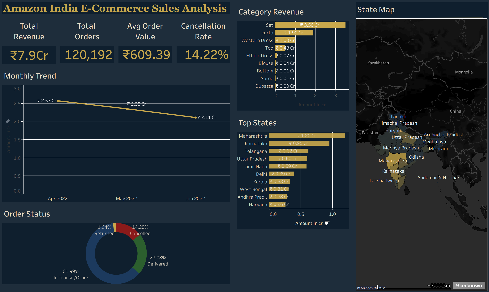
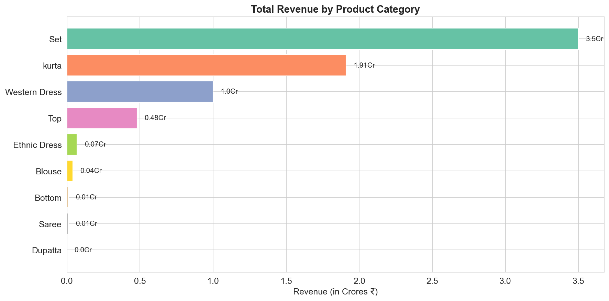
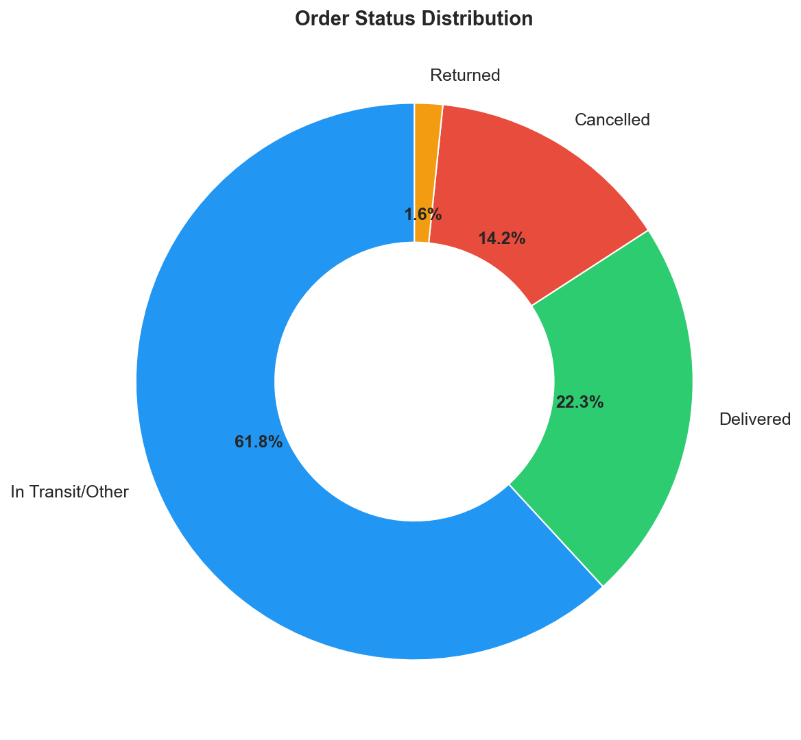
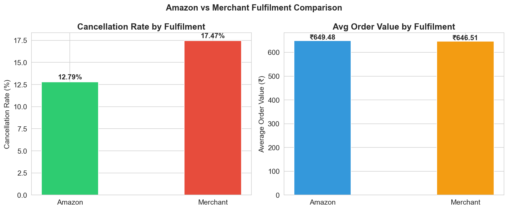
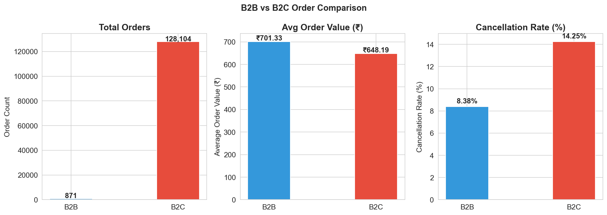
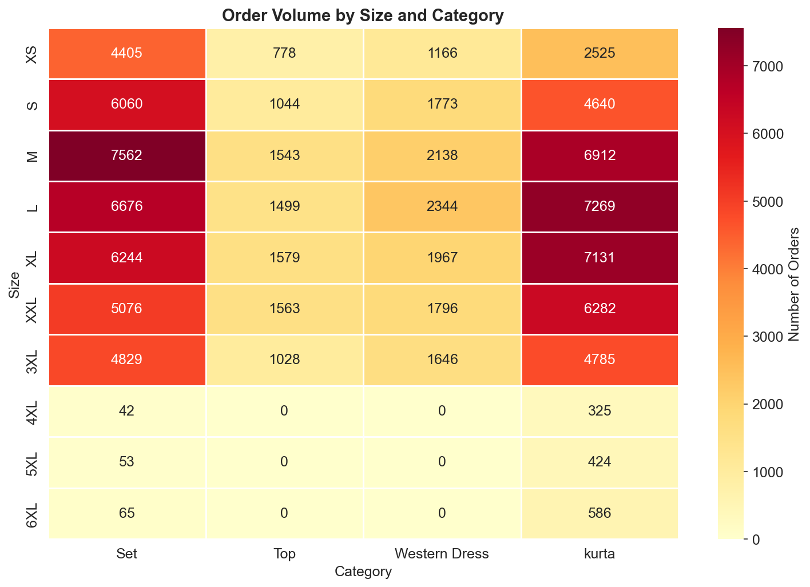
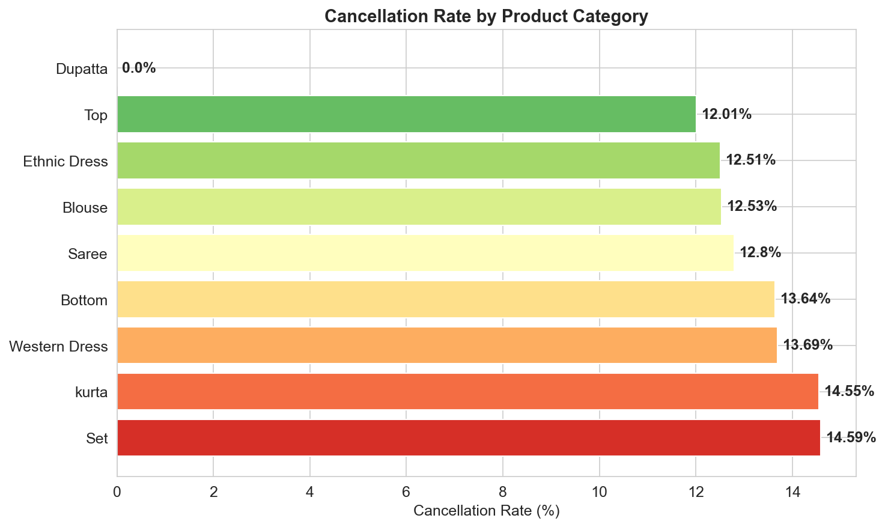

# Amazon India E-Commerce Sales Analysis



## 📊 Live Dashboard
🔗 [View Interactive Tableau Dashboard](https://public.tableau.com/app/profile/abhishek.sohal/viz/AmazonIndiaE-CommerceSalesAnalysis/Dashboard1)

---

## 📌 Project Overview
This project analyzes **128,975 Amazon India orders** across April–June 2022 to uncover revenue patterns, cancellation drivers, and fulfilment insights. The analysis follows a complete data analyst workflow — SQL querying, Python EDA, and Tableau visualization.

**Business Question:** Which product categories, states, and fulfilment strategies drive the most revenue and fewest cancellations for Amazon India sellers?

---

## 🛠️ Tools Used
| Tool | Purpose |
|---|---|
| MySQL | Data storage and business queries |
| Python (Pandas, Matplotlib, Seaborn) | Data cleaning and EDA |
| Tableau Public | Interactive dashboard |
| GitHub | Version control and portfolio |

---

## 📁 Project Structure

```
amazon-india-ecommerce-analysis/
│
├── Dashboard/
│   ├── Dashboard_overview.png
│   └── State_Map.png
├── Notebooks/
│   └── Amazon India E-Commerce Sales Analysis.ipynb
├── Sql/
│   └── Amazon India E-Commerce Sales Analysis.sql
├── Visualizations/
│   ├── category_revenue.png
│   ├── monthly_trend.png
│   ├── order_status.png
│   ├── fulfilment_comparison.png
│   ├── b2b_vs_b2c.png
│   ├── size_category_heatmap.png
│   └── cancellation_by_category.png
└── README.md

```

## 📂 Dataset
- **Source:** [Kaggle — Unlock Profits with E-Commerce Sales Data](https://www.kaggle.com/datasets/thedevastator/unlock-profits-with-e-commerce-sales-data)
- **File used:** Amazon Sale Report.csv
- **Size:** 128,975 rows × 24 columns
- **Period:** April 2022 – June 2022 (March excluded due to incomplete data)

---

## 🧹 Data Cleaning
- Dropped 7,795 rows with null/zero revenue (cancelled orders with no transaction value)
- Standardised city and state names to title case for Tableau map recognition
- Converted date column from string to datetime format
- Mapped B2B boolean column to readable B2B/B2C labels
- Filled null values in courier_status, promotion_ids, and fulfilled_by columns
- Final clean dataset: **113,517 rows**

---

## 🔍 Key SQL Insights

**1. Revenue by Category**
Sets dominate with ₹3.50Cr revenue despite equal order count with Kurtas — indicating higher average order value per Set purchase.

**2. Top States by Revenue**
Maharashtra leads with ₹1.20Cr followed by Karnataka (₹0.96Cr). Top 5 states account for 50%+ of total revenue.

**3. Order Status Distribution**
14.21% cancellation rate across all orders. 82.6% of orders are successfully shipped or delivered.

**4. Monthly Revenue Trend**
Peak revenue in April 2022 (₹2.57Cr) with steady decline through June (₹2.11Cr) — 18% drop over 3 months.

**5. Fulfilment Comparison**
Amazon-fulfilled orders have 12.79% cancellation rate vs 17.47% for Merchant-fulfilled — a 4.68 percentage point difference despite identical average order values (₹649 vs ₹647).

**6. B2B vs B2C**
B2B orders have higher average order value (₹701 vs ₹648) and significantly lower cancellation rate (8.38% vs 14.25%) — but represent only 0.67% of total volume.

**7. Top Cities within States**
Bengaluru dominates Karnataka (₹6.73L), Hyderabad dominates Telangana (₹5.06L), Mumbai leads Maharashtra (₹3.95L).

---

## 📈 Python EDA Visualizations

### Revenue by Category


### Monthly Revenue Trend


### Order Status Distribution


### Fulfilment Comparison


### B2B vs B2C


### Size vs Category Heatmap


### Cancellation Rate by Category


---

## 💡 Business Recommendations

1. **Expand FBA fulfilment** — Amazon-fulfilled orders cancel 4.68% less than merchant-fulfilled. Sellers should move more inventory to FBA to improve delivery reliability.

2. **Focus on Maharashtra and Karnataka** — These two states alone contribute 30%+ of total revenue. Targeted marketing and faster delivery in these states would have maximum impact.

3. **Invest in Set category** — Sets generate 2x the revenue of Kurtas despite similar order volumes. Premium bundled products have higher perceived value and should be promoted.

4. **Target B2B segment** — B2B customers spend 8% more per order and cancel 41% less than B2C. A dedicated B2B pricing or bulk discount program could significantly grow this segment.

5. **Investigate April–June revenue decline** — 18% revenue drop over 3 months needs further investigation. Could indicate seasonal patterns, increased competition, or supply chain issues.

---

## ⚠️ Data Limitations
- Dataset covers only 4 months (April–June 2022) — insufficient for full seasonality analysis
- March 2022 data excluded due to only 171 orders vs 40,000+ in other months
- 61.85% of orders show "Shipped" status without delivery confirmation — likely a mid-period data snapshot
- No product pricing or cost data available — profit margin analysis not possible

---

## 👤 Author
**Abhishek Sohal**
Mechanical Engineering Student | Punjab Engineering College
[GitHub](https://github.com/AbhishekSohal) | [Tableau Public](https://public.tableau.com/app/profile/abhishek.sohal)


